# Pathfinder

### Multi-Platform Autonomous Ground Vehicle Development

One ROS 2 autonomy architecture — dual-EKF RTK localization, Nav2 waypoint navigation, and a micro-ROS motor-control interface — adapted across three physical ground vehicles: a tracked skid-steer UGV, a 4×4 rover, and an Ackermann RC crawler. Each vehicle is maintained on its own branch with its own kinematics, sensor set, and field-validated tuning.

All three run outdoors on real hardware, navigating GPS waypoint missions with RTK-corrected GNSS and dual-antenna heading. No simulation — every clip on this page is a physical vehicle.

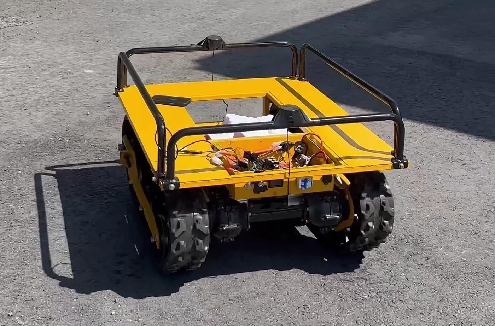

---

## At a Glance

- **Three physical vehicle platforms** — tracked skid-steer, 4-wheel differential, Ackermann steering — sharing one autonomy stack
- **ROS 2 Humble** on Raspberry Pi 5, running in Docker
- **RTK GNSS with dual-antenna heading** at up to 20 Hz, with an NTRIP client feeding corrections to the receiver
- **Dual-EKF localization** (`robot_localization`) — a local filter for smooth `odom → base_link`, a global filter for RTK-absolute `map → odom`
- **Nav2 waypoint navigation** — NavFn planner with a Regulated Pure Pursuit controller, retuned per vehicle
- **micro-ROS embedded motor control** on an ESP32-S3, the single hardware abstraction boundary shared by all three vehicles
- **Web mission console** — draw waypoints on a map, watch live RTK telemetry, stop the vehicle

---

## Vehicles

| | Tracked UGV | 4×4 UGV | RC Crawler |
|---|---|---|---|
| |  | 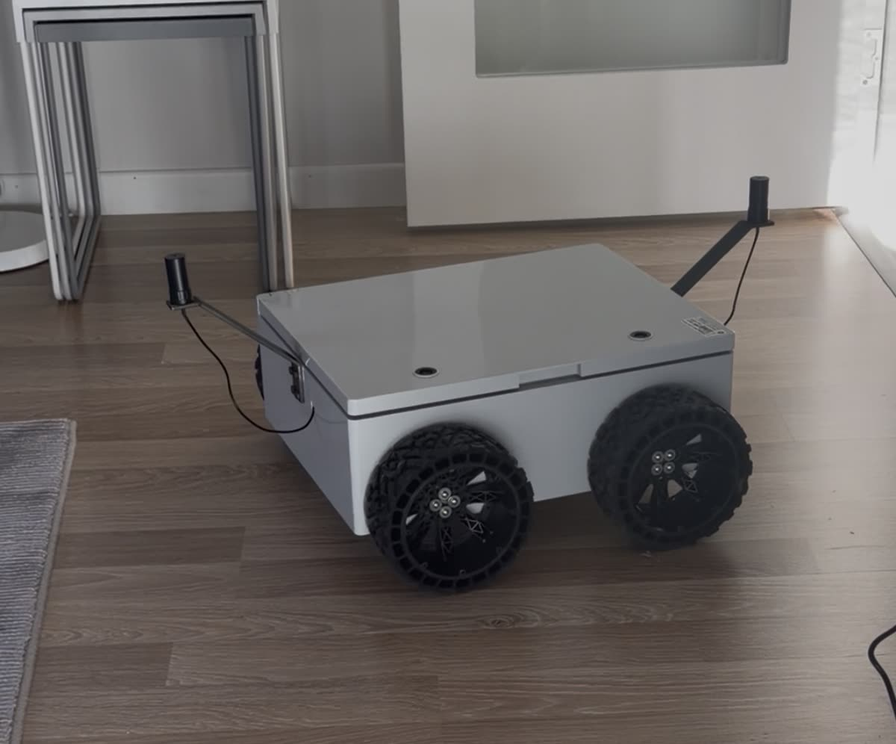 | 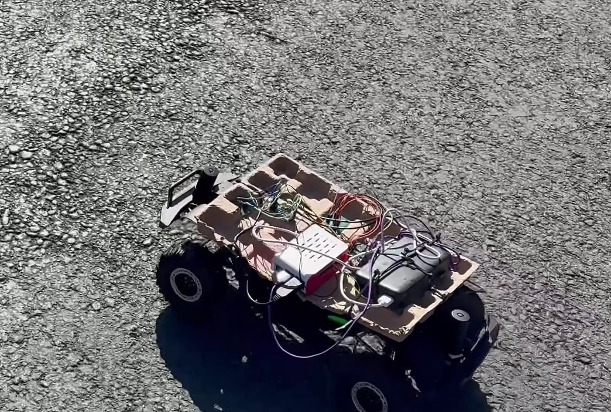 |
| **Drive** | Tracked skid-steer | 4-wheel differential | Ackermann steering |
| **Branch** | [`paletli`](../../tree/paletli) | [`rover-4x4`](../../tree/rover-4x4) | [`rc-crawler`](../../tree/rc-crawler) |

---

## Shared Autonomy Architecture

Every vehicle runs the same two ROS 2 packages, the same launch files, and the same localization and navigation topology. What changes per vehicle is configuration: kinematic limits, EKF inputs, costmap footprint, controller tuning.

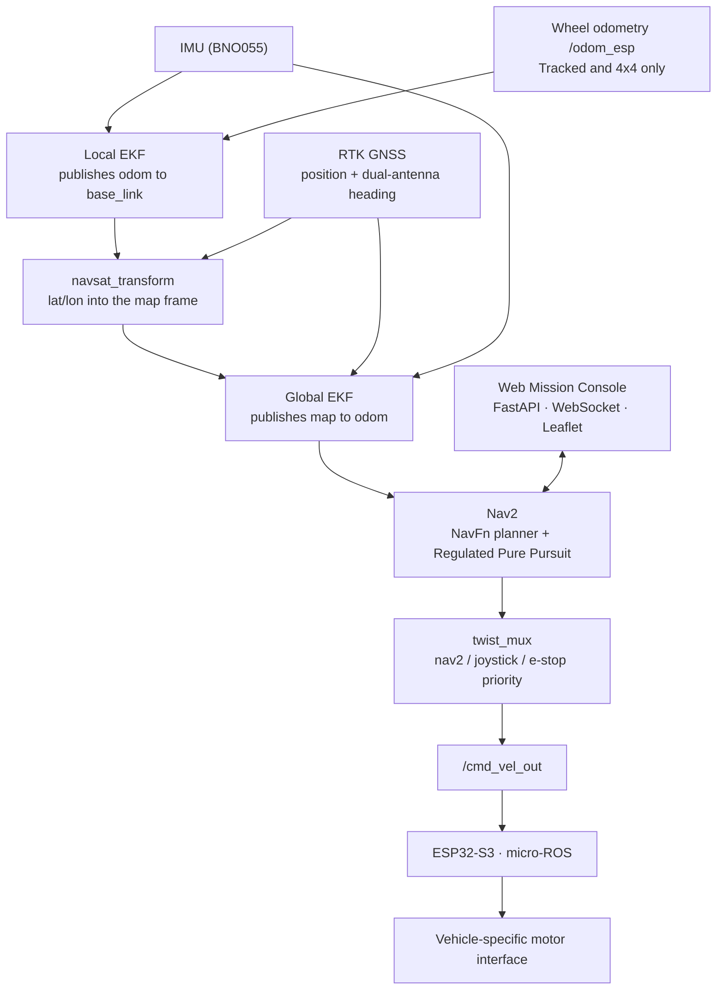

**The abstraction boundary is `/cmd_vel_out` and `/odom_esp`.** Everything above it — localization, planning, control, the mission console — is identical across the fleet. Everything below it is vehicle-specific: tracks, four wheels, or a steering servo. Porting the stack to a new platform means writing the firmware behind that boundary and retuning the layer above it, not rewriting the autonomy.

The RC Crawler has no wheel encoders at all, so its local EKF runs on IMU alone and its position comes entirely from RTK GNSS. The architecture absorbs that without structural change — one input is simply switched off.

---

## Vehicle 01 — Tracked UGV

**Branch: [`paletli`](../../tree/paletli)**

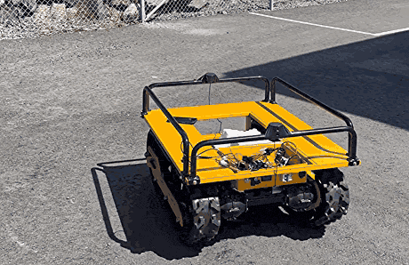

The largest platform: a 1.0 × 0.74 m tracked chassis with 0.625 m between track centrelines, driving skid-steer.

| | |
|---|---|
| **Drive** | Tracked, differential / skid-steer |
| **Compute** | Raspberry Pi 5, ROS 2 Humble in Docker |
| **Motor control** | ESP32-S3 micro-ROS bridge to the drive controllers |
| **Positioning** | RTK GNSS at 20 Hz with dual-antenna heading |
| **IMU** | BNO055 over UART |
| **Perception** | Hesai XT16 3D LiDAR — *visualisation only, see below* |
| **Localization** | Dual EKF: wheel odometry + gyro locally, RTK position + absolute GNSS heading globally |
| **Navigation** | Nav2, Regulated Pure Pursuit, ~0.95 m/s target, plus a planner-free straight-line mission mode |

**Engineering challenge — velocity budgeting on skid-steer.**
On a skid-steer platform, each track's speed is the sum of the body's linear and angular commands:

```
v_track = v ± ω · (track_separation / 2)
```

Ask for speed and yaw at the same time and the outer track saturates, the turn degrades, and the vehicle drifts off the path. The fix is a yaw-priority budget enforced in firmware: the commanded turn rate is always delivered in full, and forward speed is clipped to whatever headroom remains. Nav2's regulated speed scaling handles it feed-forward; the firmware budget guarantees it.

**Field calibration tooling.** Wheel-odometry scale was calibrated against pure RTK displacement rather than guessed, and missions are recorded to JSONL (waypoints, plan, pose, commands, RTK status) so tuning changes are argued from logs instead of impressions.

**LiDAR transport.** Streaming a 2.4 MB point cloud at 10 Hz over the vehicle's own WiFi needed CycloneDDS tuning — unicast data with multicast limited to discovery, and a 10 MB socket receive buffer — to stop fragment loss.

> **Note:** the LiDAR feeds the mission console's 2D obstacle view. It is not wired into the Nav2 costmaps, and this vehicle does not perform autonomous obstacle avoidance.

<details>
<summary>More images</summary>

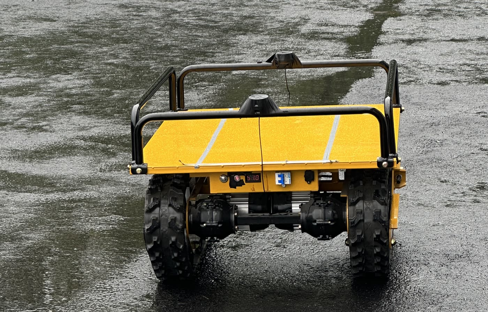
*Running gear and roof-mounted GNSS antenna, wet-weather operation.*

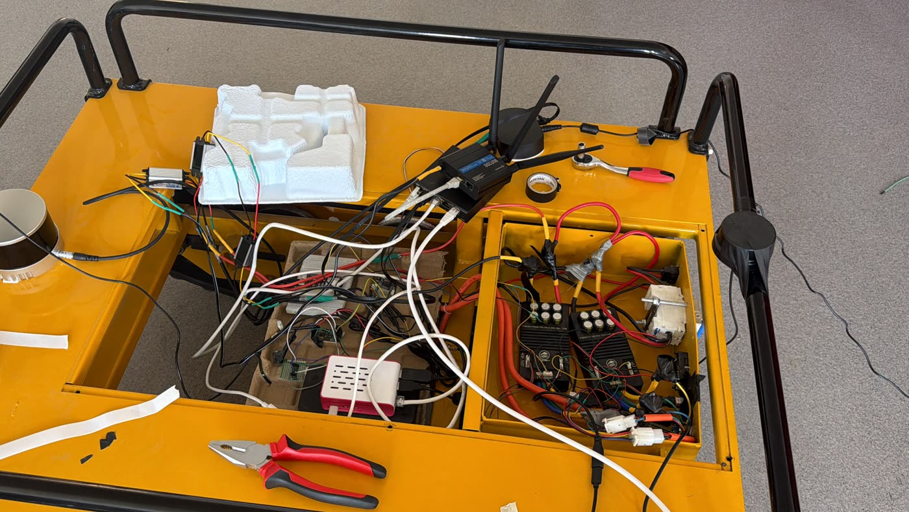
*Compute and power bay during integration — Raspberry Pi, network switch, motor controllers.*

</details>

---

## Vehicle 02 — 4×4 UGV

**Branch: [`rover-4x4`](../../tree/rover-4x4)**

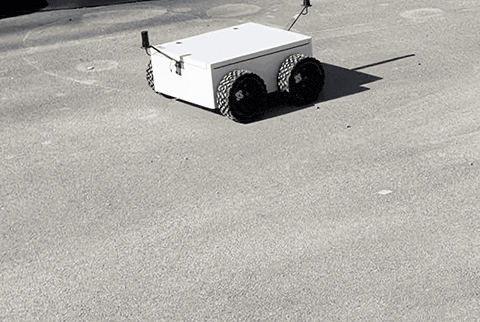

A compact 0.5 × 0.4 m four-wheel differential rover — the platform where the localization stack was brought to a working state.

| | |
|---|---|
| **Drive** | 4-wheel differential (skid) drive |
| **Compute** | Raspberry Pi 5, ROS 2 Humble in Docker |
| **Motor control** | ESP32-S3 micro-ROS → **2 × RoboClaw**, closed-loop velocity control on the controllers' internal PID |
| **Positioning** | RTK GNSS with dual-antenna heading, parsed from the receiver's binary protocol |
| **IMU** | BNO055 over UART |
| **Localization** | Dual EKF: wheel odometry + gyro locally, RTK position + absolute GNSS heading globally |
| **Navigation** | Nav2, Regulated Pure Pursuit, 0.8 m/s target, rotate-to-heading enabled |

**Engineering challenge — heading and datum correctness.**
Outdoor GPS navigation fails in a specific and confusing way when heading is wrong: the vehicle drives confidently in the wrong direction. This platform is where that got solved, and the fix is a separation of two different yaw signals:

- **Relative gyro yaw** feeds the *local* filter. It starts at zero wherever the vehicle happens to be pointing and only has to be smooth — it makes short-term motion continuous and jitter-free.
- **Absolute GNSS heading**, from the dual-antenna receiver, feeds the *global* filter. It is slower but it is true north, and it is what anchors the map frame.

Mixing them — or letting the magnetic-style relative yaw into the global filter — produces a vehicle that navigates smoothly along the wrong bearing. Keeping them in separate filters is what makes waypoint missions land where they should.

The map origin is set the same way: a dedicated node waits for several consistent RTK-fixed positions *and* a valid heading before it fixes the datum, so a single bad fix during acquisition can't offset the entire map.

<details>
<summary>More images</summary>

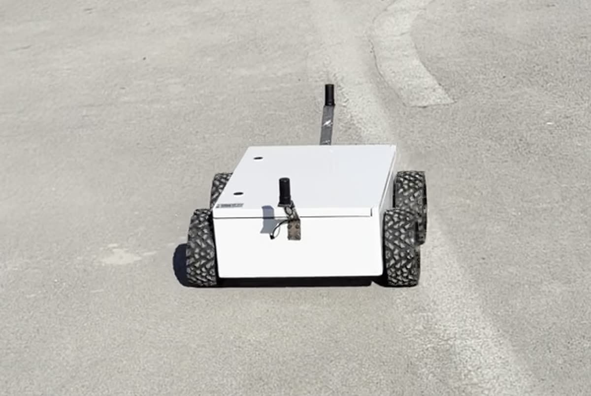
*Outdoor waypoint run; both GNSS antennas visible.*

</details>

---

## Vehicle 03 — RC Crawler

**Branch: [`rc-crawler`](../../tree/rc-crawler)**

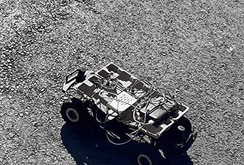

A car-like platform: 0.313 m wheelbase, up to 46° of steering, and the constraint that makes it interesting — **no wheel encoders anywhere on the vehicle.**

| | |
|---|---|
| **Drive** | Ackermann steering, 0.313 m wheelbase, up to 46° |
| **Compute** | Raspberry Pi 5, ROS 2 Humble in Docker |
| **Motor control** | ESP32-S3 micro-ROS bridge |
| **Positioning** | RTK GNSS at 20 Hz with dual-antenna heading |
| **IMU** | BNO055 over UART |
| **Wheel odometry** | **None** |
| **Navigation** | Nav2 tuned for non-holonomic motion — up to 1.6 m/s, reversing enabled, rotate-to-heading disabled, recovery-free behavior trees |

**Engineering challenge — localization with no odometry.**
With no encoders there is no dead-reckoning source. The accelerometer is not a substitute: integrating it twice, with no absolute reference to correct against, guarantees the position runs away. So the local filter is deliberately reduced to a heading estimator — gyro only, accelerometer explicitly disabled — and *all* position information comes from RTK GNSS through the global filter.

That topology has a trap. If the GPS-derived odometry is published in the `odom` frame and then fed back into the filter that produces `map → odom`, the estimate reinforces its own error and the vehicle's position drifts away without bound. Resolving it meant referencing the GPS conversion to the global estimate so its output lands in the `map` frame, breaking the loop. The correction is documented at the point where it matters, and a diagnostic script asserts on a live system that the fix is actually in effect — so the bug cannot quietly return after a config change.

Nav2 needed matching treatment. A car cannot spin in place or shuffle backwards out of trouble, so the default spin and back-up recoveries are removed entirely and replaced with recovery-free behavior trees, with reversing allowed as a deliberate manoeuvre instead.

<details>
<summary>More images</summary>

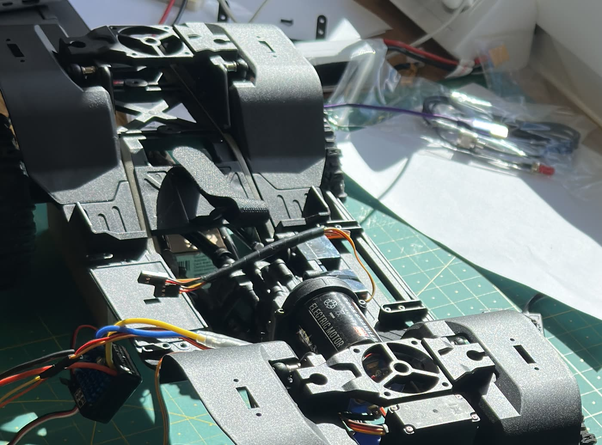
*Chassis during integration — drivetrain, steering and motor before the compute stack went on.*

</details>

---

## Vehicle Comparison

| | **Tracked UGV** | **4×4 UGV** | **RC Crawler** |
|---|---|---|---|
| **Drive** | Tracked skid-steer | 4-wheel differential | Ackermann steering |
| **Localization** | Dual EKF — wheel odom + gyro + RTK + GNSS heading | Dual EKF — wheel odom + gyro + RTK + GNSS heading | Dual EKF — gyro + RTK + GNSS heading, accelerometer disabled |
| **Wheel odometry** | Yes, RTK-calibrated scale | Yes, from encoders via RoboClaw | **None** |
| **Navigation** | Nav2 / RPP, plus planner-free straight-line mode | Nav2 / RPP with rotate-to-heading | Nav2 / RPP, no in-place rotation, recovery-free BTs |
| **Sensors** | RTK GNSS + heading, IMU, LiDAR *(visualisation only)* | RTK GNSS + heading, IMU | RTK GNSS + heading, IMU |
| **Main challenge** | Velocity budgeting across two tracks | Heading and datum correctness | Autonomy with no odometry source |

---

## Web Mission Console

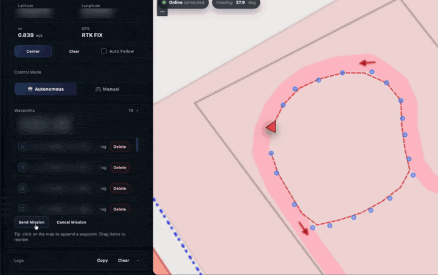

A FastAPI service bridges ROS 2 to a browser over WebSocket, with a Leaflet map front end. Verified functionality:

- **Waypoint missions** — click the map to append waypoints, drag to reorder, delete individually, then send the mission to Nav2
- **Live telemetry** — position, speed, heading and GNSS fix quality (including RTK FIX state) streamed continuously
- **Track trace** — the driven path is drawn on the map alongside the planned route
- **Navigation control** — send, cancel, and an emergency stop that publishes a zero velocity command at the highest mux priority
- **Manual mode** — an on-screen joystick that drives the vehicle through the same arbitration chain

---

## Repository Layout

`main` is the portfolio landing branch — documentation and media only. Each vehicle's
source lives on its own branch:

```
main                     this page, docs/ and media
  ├── paletli            Tracked UGV   - full ROS 2 source
  ├── rover-4x4          4x4 UGV       - full ROS 2 source
  └── rc-crawler         RC Crawler    - full ROS 2 source
```

Every vehicle branch has the same shape:

```
src/rover_bringup/       launch files, URDF, EKF / Nav2 / twist_mux configuration
src/swegeo_driver/       GNSS receiver driver - NTRIP client, position and heading
src/bno055/              vendored BNO055 IMU driver (third party)
apps/pathfinder_webapp/  FastAPI backend and Leaflet mission console
ntrip.env.example        RTK correction settings - copy to ntrip.env, never committed
```

`paletli` additionally vendors the Hesai LiDAR ROS 2 driver.

### Development history

These three platforms were developed in sequence, each forked from the one before it:

```
2WD base rover  ->  4x4 UGV  ->  Tracked UGV
                          \->  RC Crawler
```

The original 2WD rover was the platform the stack was first built on. It is not part of
this portfolio repository; the three branches above are the current work. Development
history is kept in a separate private archive, so this repository starts from a clean
slate.

### Embedded motor control

The micro-ROS firmware that sits behind `/cmd_vel_out` runs on an ESP32-S3 and is
maintained as a separate project. It is intentionally **not** vendored or linked as a
submodule here, so this repository stays self-contained and publishable on its own. The
firmware converts incoming twists into closed-loop wheel velocities and publishes
encoder odometry back to ROS 2 on `/odom_esp`.

## Related Repositories

- **[stm32h7-ros2-udp-link](https://github.com/MustafaSPN/stm32h7-ros2-udp-link)** —
  deterministic ROS 2 ↔ STM32 motion-control link over Ethernet/UDP, exploring the same
  embedded-to-ROS boundary with harder timing requirements.

## Scope

To be clear about what this project does and does not do:

- Navigation is **outdoor GPS waypoint following**. There is no SLAM and no map building.
- There is **no simulation** — all development and tuning was done on physical hardware outdoors.
- The costmaps carry no obstacle sensor, so there is **no autonomous obstacle avoidance**. The tracked vehicle's LiDAR is a visualisation feed only.
- Vehicles are **maintained on separate branches**, not selected at runtime from a single configurable package.
