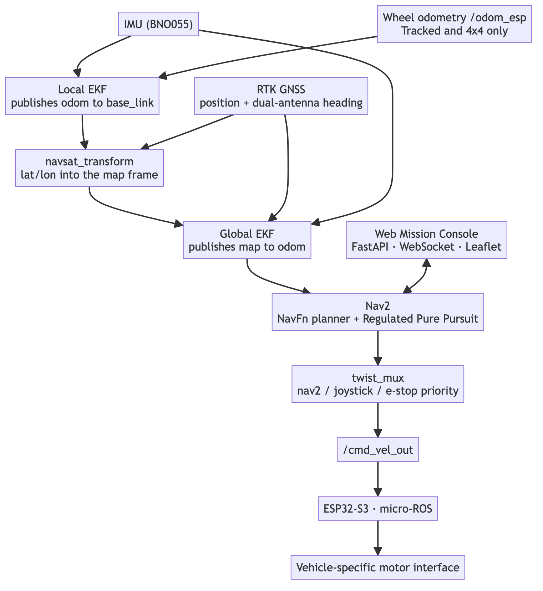
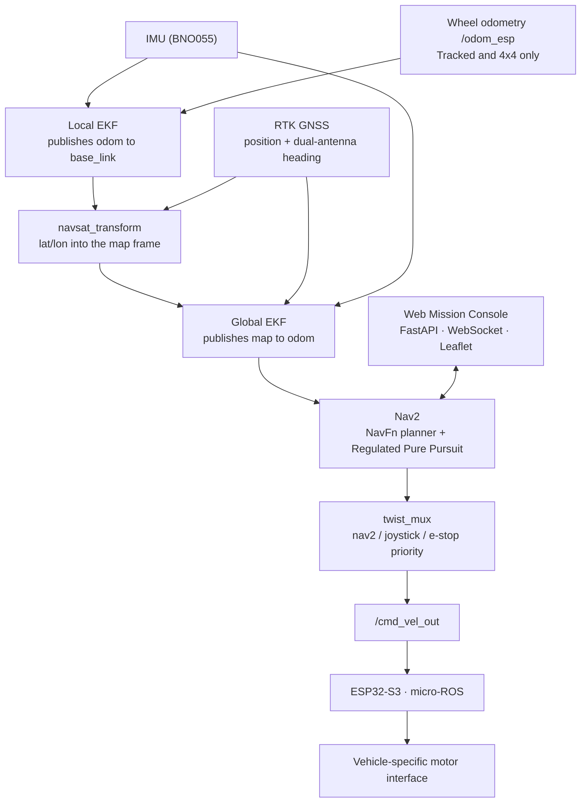

# Shared Autonomy Architecture

All three vehicles run the same two ROS 2 packages, the same launch files and the same
localization and navigation topology. What changes per vehicle is configuration:
kinematic limits, EKF inputs, costmap footprint and controller tuning.

<p align="center">
  <picture>
    <source media="(prefers-color-scheme: dark)" srcset="../media/architecture-detailed-dark.png">
    
  </picture>
</p>

<details>
<summary>Diagram source (Mermaid)</summary>



Rendered with `mmdc -i architecture-detailed.mmd -o ../media/architecture-detailed-light.png -t default -b "#ffffff" -w 1000 -s 2`
(and `-t dark -b "#0d1117"` for the dark variant). The images are committed because
GitHub renders Mermaid client-side, which does not run in the GitHub mobile app.

</details>

## The abstraction boundary

The boundary between shared autonomy and vehicle-specific hardware is exactly two topics:

| Topic | Direction | Meaning |
|---|---|---|
| `/cmd_vel_out` | autonomy → vehicle | the arbitrated velocity command, after Nav2, the velocity smoother and `twist_mux` |
| `/odom_esp` | vehicle → autonomy | wheel odometry measured by the embedded controller |

Everything above that line — the dual EKF, `navsat_transform`, Nav2, the mission console —
is identical across the fleet. Everything below it is vehicle-specific: tracks, four
wheels, or a steering servo. Porting the stack to a new platform means writing the
firmware behind that boundary and retuning the layer above it, not rewriting the autonomy.

## Where the vehicles genuinely differ

| | Tracked UGV | 4x4 UGV | RC Crawler |
|---|---|---|---|
| `/odom_esp` present | yes | yes | **no — no wheel encoders** |
| Local EKF inputs | wheel odometry + gyro | wheel odometry + gyro | gyro only, accelerometer disabled |
| Absolute position | RTK GNSS | RTK GNSS | RTK GNSS (the only position source) |
| Heading | dual-antenna GNSS (absolute) + gyro (relative) | same | same |

The RC Crawler is the interesting case. With no encoders there is no dead-reckoning
source at all, and integrating the accelerometer twice with no absolute reference would
let position run away. So its local filter is reduced to a heading estimator and every
bit of position information arrives through RTK GNSS via the global filter. The
architecture absorbs that without structural change — one input is simply switched off.

## Frames

```
map  --(global EKF)-->  odom  --(local EKF)-->  base_link
                                                   |
                     base_footprint, gps_link, imu_link,
                     wheel / track links, hesai_lidar (Tracked UGV)
```

`map -> odom` is published by the global EKF, `odom -> base_link` by the local EKF, and
the static vehicle frames come from `robot_state_publisher` reading that vehicle's URDF.

## Scope

Navigation is outdoor GPS waypoint following. There is no SLAM and no map building — the
costmaps run against a blank latched grid. There is no simulation. No obstacle sensor is
wired into the costmaps, so there is no autonomous obstacle avoidance; the Tracked UGV's
LiDAR feeds the mission console's 2D view only.
